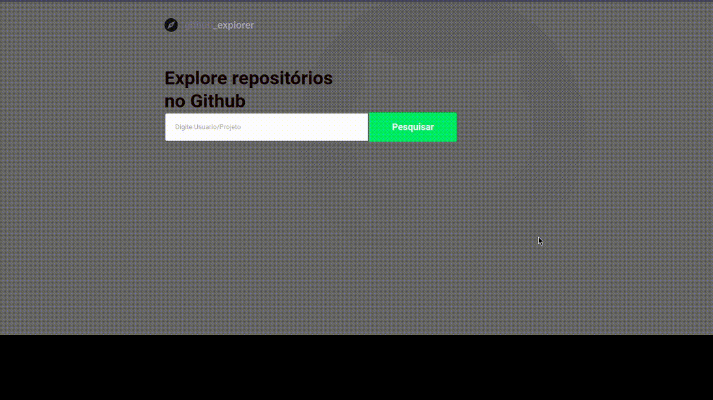

<div style="display: flex; justify-content: center; align-items: center;">
  
</div>

## **Aplicação Github explorer**

Desenvolvido no _Bootcamp Gostack_ a aplicação utiliza API do github para realizar buscas de projetos e usuários.

## Tecnologias Usadas

[ReactJS](https://reactjs.org/)

[React-hooks](https://pt-br.reactjs.org/docs/hooks-intro.html)

[React-router-dom](https://reacttraining.com/react-router/web/guides/quick-start)

[Styled-Components](https://styled-components.com/)

[React-icons](https://react-icons.github.io/react-icons/)

[Eslint](https://eslint.org/)

[Prettier](https://prettier.io/)

[axios](https://github.com/axios/axios)

## Como usar Projeto
```bash
    # Clone this repository
    $ git clone https://github.com/Carlos-Reiss/github-explorer.git

    # Go into the repository
    $ cd github-explorer

    # Install dependencies
    $ yarn install ou npm install

    # Running brownser
    $ yarn start ou npm start

```
## Preview do projeto

<p align="center">
  
</p>


